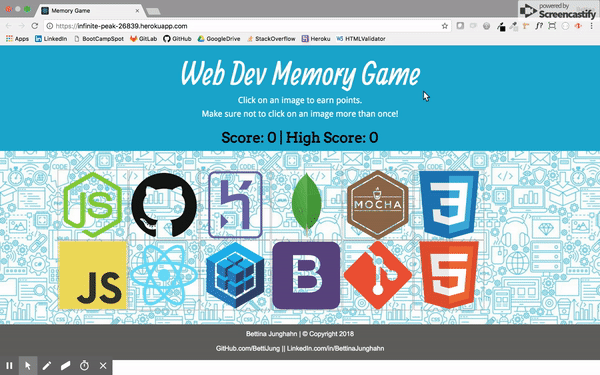

# Web Dev Memory Game
This is a serverless Web-Dev themed memory game built using React. The app's state shuffles around the images available to make it challenging. Play away!

## View of the App
App can be used [here](https://infinite-peak-26839.herokuapp.com/).



### Downloading This Application
To use this application:

1. Clone this repo to your local machine:
```
git clone git@github.com:bettijung/memory-game.git
```
2. Open the repo and execute the following in the bash terminal. Doing so should install the required packages/dependencies:
```
yarn install
```
3. Ready to play on your local? Try:
```
yarn start
```

### Technologies Used:
- React.js
- Bootstrap